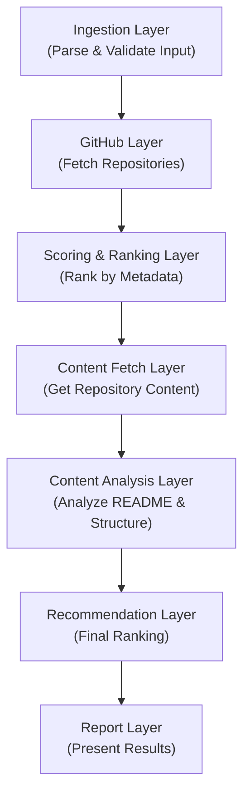

# RepoLens v0

A CLI-based GitHub repository discovery engine focused on helping developers find repositories that are easier to learn from.

## Purpose

Finding repositories for learning on GitHub is often overwhelming. A simple search can return hundreds or thousands of results, with little indication of which projects are well-documented, organized, and suitable for study.

RepoLens solves this problem by:

- Retrieving repositories from GitHub based on a user query
- Filtering unsuitable repositories through configurable gates
- Ranking repositories using metadata-based scoring
- Analyzing repository content and structure
- Recommending repositories that are easier to understand and explore

**Version 0** focuses on repository discovery, ranking, and basic content analysis.

---

## Features

1. **Repository Fetching** - Search GitHub repositories by query keywords, programming language, and last pushed date.
2. **Metadata Scoring** - Evaluate repositories using fork-to-star ratio, open issues, description quality, and license presence.
3. **Content Analysis** - Analyze README quality and repository structure to assess documentation and code organization.
4. **Smart Ranking** - Apply configurable gate mechanisms to filter and rank repositories by relevance.
5. **Recommendation Engine** - Generate combined recommendations using metadata and content analysis scores.

---

## Architecture



Each layer contains its own orchestration logic and is responsible for a single stage of the pipeline.

---

## Installation

### 1. Clone the Repository

```bash
git clone <repository-url>
cd repolens
```

### 2. Create a Virtual Environment

```bash
python -m venv venv
```

Activate the environment:

```bash
# Windows
venv\Scripts\activate

# Linux / macOS
source venv/bin/activate
```

### 3. Install Dependencies

```bash
pip install -r requirements.txt
```

### 4. Configure Environment Variables

Create a `.env` file:

```env
GITHUB_TOKEN=your_github_token
```

### 5. Run RepoLens

```bash
python main.py "query"
```

---

## Example Queries

### Local Execution

Search for machine learning repositories in Python:

```bash
python main.py "machine learning" python -ms 50 -mx 500
```

Search for JavaScript web frameworks updated within the last 6 months:

```bash
python main.py "web framework" javascript -u 6
```

Search for REST API projects:

```bash
python main.py "rest api"
```

### Docker

```bash
docker run \
  --env GITHUB_TOKEN=your_token_here \
  repolens:latest \
  "search query"
```

---

## Future Work

1. **Technology Detection** - Automatically identify and extract technology stack from repositories.
2. **Complexity Analysis** - Estimate repository difficulty level (Beginner, Intermediate, Advanced).
3. **Feature Detection** - Identify implemented capabilities and design patterns in repositories.
4. **Learning Path Generation** - Suggest repositories in progressive order based on complexity.
5. **Query Relevance Engine** - Improve recommendations by evaluating repository-to-query alignment.
6. **Batch Processing** - Support multiple queries and comparative analysis across results.
7. **Export Capabilities** - Generate reports in multiple formats (PDF, JSON, CSV).

---

## Current Status

RepoLens v0 is an experimental learning-focused repository discovery engine.

Current capabilities:

- GitHub repository retrieval
- Metadata-based ranking
- README analysis
- Repository structure analysis
- Basic recommendation generation

Future versions will focus on recommendation quality, feature detection, complexity estimation, and learning-path generation.